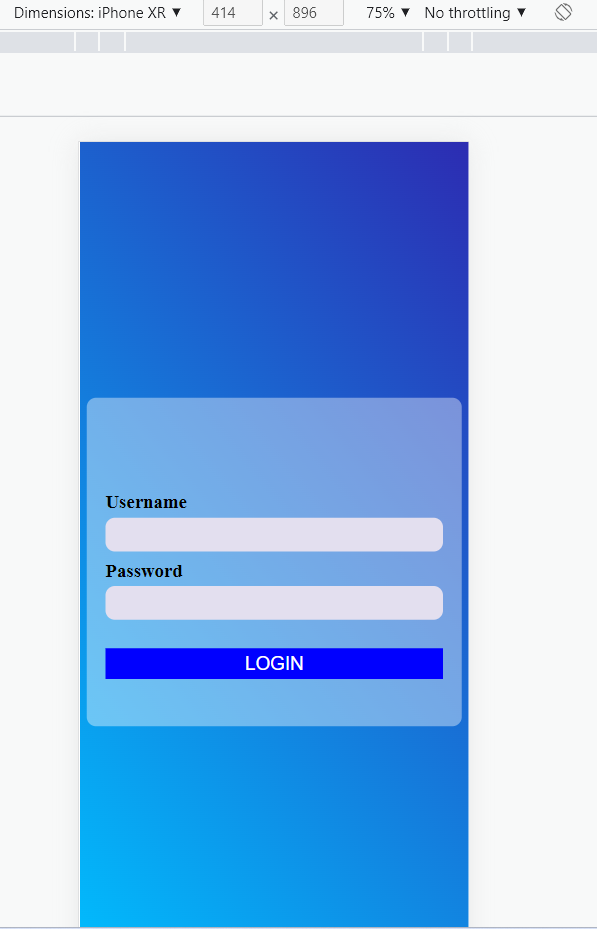
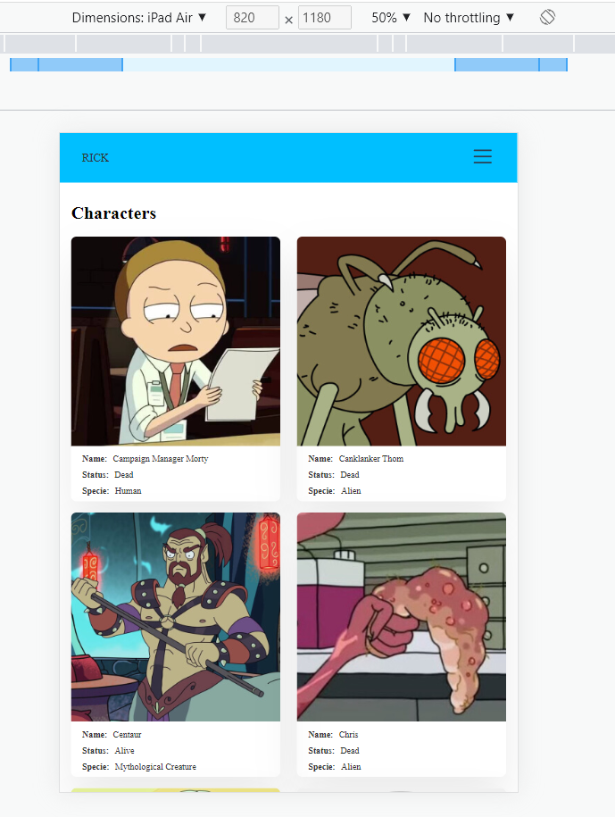

# Proyecto 3 (LOGIN, DASHBOARD, LIT)
Este proyecto es una aplicación para ver información sobre personajes de Rick y Morty.
Disponemos de un login, `el usuario es useradmin y la contraseña es 1234`.

`
PD: Si usas VSCode, arriba a la derecha de este fichero hay un icono de 2 columnas con una lupa pequeña debajo, si clickeas ahi puedes ver la preview de este documento
`


## Estructura de carpetas
```
.
└── Proyecto
    ├── index.html
    ├── package.json
    ├── package-lock.json
    ├── README.md
    └── src
        ├── index.js
        ├── MainApp.js
        ├── routes.js
        ├── components
        │   ├── character-details-row
        │   │   └── CharacterDetailsRow.js
        │   ├── container
        │   │   └── Container.js
        │   ├── gallery-item
        │   │   └── GalleryItem.js
        │   ├── header
        │   │   ├── Hamburger.js
        │   │   ├── Header.js
        │   │   └── Navigation.js
        │   ├── router
        │   │   ├── BrowserRouter.js
        │   │   └── LitLink.js
        │   └── template-page
        │       └── TemplatePage.js
        ├── pages
        │   ├── Dashboard.js
        │   ├── DashboardDetails.js
        │   └── Login.js
        └── services
            └── api.js
```

## Instalacion

Actualmente estoy corriendo node en la version 18.14.2

Instalar las dependecias e iniciar el servidor
```sh
cd login-dashboard
npm install
npm run dev
```

## Scripts disponibles

### Arrancar el servidor
```sh
npm run dev
```

### Buildear el servidor
Se generará bajo una carpeta llama dist

```sh
npm run build
```

### Visualizar el proyecto buildeado
El comando preview arrancará un servidor web estático local que sirve los archivos de dist en http://localhost:4173. Es una manera fácil de comprobar si la construcción de producción se ve bien en su entorno local.

```sh
npm run preview
```

## Imágenes
### Desktop
#### Login
##### Default


##### Usuario incorrecto


##### Loading


#### Dashboard


Disponemos de un efecto de hover, al pasar el ratón por encima de una card, ésta se eleva un poco y cambia el sombreado (tercera card)


#### Dashboard details


Disponemos de un efecto hover, al pasar el ratón sobre la imagen, ésta hace un zoom pequeñito


### Mobile
#### Login


Login incorrecto


#### Dashboard


Disponemos de un menu responsive que siempre será accesible desde el móvil


#### Dashboard details


### Tablet
Para la vista tablet, la única diferencia que hay con la version de desktop es que el grid es de 2 columnas en vez de 3 y tenemos el menu de móvil




## Ruter

Disponemos de un router hecho desde 0. Éste se compone de 2 elementos:
  - LitLink: Un elemento anchor en el que desactivamos el comportamiento de recarga que tiene por defecto, cambiamos la url y despues creamos un evento para advertir que se ha cambiado

  - BrowserRouter: Dependiendo de la ruta en la que estemos y del array de rutas que le pasamos. Se pinta el componente especificado en el fichero routes.js.
  Dispone de unos listener que se encargan de escuchar los cambios en la url para poder pintar el componente adecuado
    